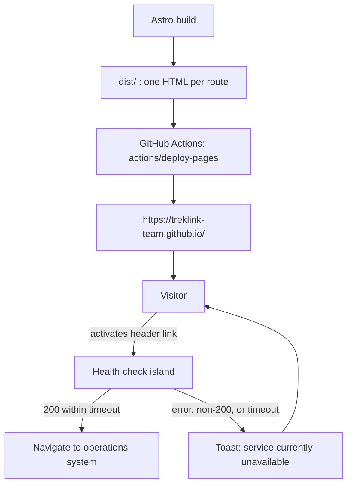

# Technical Design: landing

Implements [`requirements.md`](requirements.md).

---

## 1. Overview

A statically pre-rendered marketing site, built with Astro, deployed to GitHub Pages from a GitHub
Actions workflow. Every route is a real HTML file. The only runtime behaviour is a health check, a
carousel, a scrollspy and a language switch, each delivered as an isolated island so that the page
renders and reads with JavaScript disabled.

### 1.1 Why Astro rather than Vite

Question 19 allowed either. The deciding fact came from research after that answer: a
client-side-routed application on GitHub Pages returns **HTTP 404 for every deep link** unless it
uses the `404.html` redirect trick, and that trick still returns a 404 status for a valid page. It
harms indexing and makes some browsers flash an error banner.

Astro emits one real HTML document per route, so every canonical URL is a true 200 (REQ-UBI-03).
It also ships zero JavaScript by default and hydrates only the islands that need it, which is what
makes the §3 performance targets reachable with photography-heavy content. Astro uses Vite
underneath, so the toolchain is not foreign to the team.

The cost, stated plainly: the landing site does not share a build config with `treklink-web/frontend`.
Question 76 accepted that, because a landing page does not have to match the application's stack.

### 1.2 Why a separate repository

A GitHub Pages **user site** must live in a repository named exactly `<owner>.github.io`, which is
why this folder is named `TrekLink-Team.github.io`. GitHub fixes the name; it was not chosen. In
exchange the site serves from `https://treklink-team.github.io/` with no path prefix, the shortest
free URL available (question 74).

The separation is also a terms-of-service matter. GitHub Pages prohibits sensitive transactions
involving passwords or payment. The operations system has both, so it is hosted elsewhere and only
linked to from here. Keeping the public site out of `treklink-web` keeps that boundary obvious.

---

## 2. Architecture



***Figure 1***: Build, deploy and the only runtime decision on the page. The visitor never waits on
the health check to read the site. Placement: inline, 182.0 x 120.0 mm, labels at 9.0 pt.

### 2.1 Route map

| Route | File | Locale |
|---|---|---|
| `/` | `src/pages/index.astro` | English, default |
| `/vi/` | `src/pages/vi/index.astro` | Vietnamese |
| `/404` | `src/pages/404.astro` | A genuine not-found page, not a routing workaround |

One page per locale. The content is a single scrolling document with anchored sections, which is
what the scrollspy in REQ-EVT-06 indexes. More routes are added only if the content outgrows one
page.

### 2.2 Directory layout

```text
specs/landing/           requirements.md, design.md, tasks.md
src/
  components/            Header, Hero, Problem, ProductLines, ResearchDevelopment, Footer
  islands/               SystemLink, Carousel, Scrollspy, LanguageSwitcher
  layouts/               Base.astro: head, skip link, locale wiring
  pages/                 index.astro, vi/index.astro, 404.astro
  i18n/                  en.json, vi.json, index.ts
  styles/                tokens.css, global.css
site.config.ts           operations URL, health endpoint, timeout, analytics id
public/
  images/products/       product photographs, dropped in by the leader
  images/placeholders/   typographic stand-ins of identical aspect ratio
.github/workflows/       deploy.yml
```

---

## 3. Components and Interfaces

### 3.1 Static components, zero JavaScript

| Component | Responsibility |
|---|---|
| `Header` | Wordmark, section navigation, language switcher slot, system link slot. Sticky. |
| `Hero` | The product advert. One product photograph, headline, subheadline. No call to action into the system here; question 11 puts that link in the header. |
| `Problem` | What no signal on a trek route costs. Written for a general reader. |
| `ProductLines` | The device variants, as a card grid feeding the carousel island. |
| `ResearchDevelopment` | The R&D section from question 12. General and professional, no research question identifiers, no metrics that are not yet measured. |
| `Footer` | Contact, repository link, copyright. |

### 3.2 Islands

Each hydrates independently. A failure in one does not affect the others.

**`SystemLink`**, the only island whose absence changes behaviour rather than polish.

```ts
type Availability = 'idle' | 'checking' | 'up' | 'down';

// On activation, never on page load. Checking on load would make every visitor
// pay for a request that most of them never need, and would put a backend
// outage on the critical path of a page that must not depend on it.
async function check(signal: AbortSignal): Promise<boolean>;
```

It uses `AbortController` with the configured timeout (REQ-ERR-02), treats any rejection or
non-success status as unavailable (REQ-ERR-01), and surfaces neither status code nor endpoint.
Without JavaScript it degrades to a plain anchor, which is the correct fallback: the visitor
reaches the system directly and the browser reports any failure itself.

**`Carousel`** honours `prefers-reduced-motion` (REQ-STA-02), exposes previous and next controls to
the keyboard, and announces item changes through a live region (REQ-EVT-07).

**`Scrollspy`** uses `IntersectionObserver` and only sets an active state. It never moves the page.

**`LanguageSwitcher`** navigates to the mirrored route and persists the choice in `localStorage`
(REQ-EVT-05). It is an anchor first, so it works without JavaScript.

### 3.3 Configuration

`site.config.ts` is the single source for every environment-dependent value (REQ-UBI-05):

| Key | Purpose | Initial value |
|---|---|---|
| `operationsUrl` | Where the header link goes | placeholder until the backend is deployed, open question Q1 |
| `healthEndpoint` | What the availability check requests | placeholder, Q1 |
| `healthTimeoutMs` | Abort threshold | `3000` |
| `analyticsId` | Cookieless analytics site id | set in phase 5, Q2 |
| `site` | Canonical origin, used for absolute URLs | `https://treklink-team.github.io` |

---

## 4. Locale System

Question 9 requires a real locale system, not translated duplicates.

- `src/i18n/en.json` and `vi.json` are flat key-to-string catalogues. English is the reference.
- `src/i18n/index.ts` exports `t(locale, key)`, which falls back to the English entry when the
  Vietnamese one is missing (REQ-STA-04). It never returns a raw key to the page.
- A page renders by locale; no string is inline in a component (REQ-UBI-04).
- English ships complete. Vietnamese ships as a route with partial coverage and visible fallback,
  which is the honest state rather than a half-translated page pretending to be finished.

---

## 5. Visual Design

From question 15. The brief is pastel dark military green, forestry and lumber typography in a US
lumberjack register, bold and impactful, with neomorphism and glassmorphism. Structure follows
Garmin: product photography carries the hierarchy, not iconography.

### 5.1 Tokens

Defined once in `src/styles/tokens.css` as CSS custom properties. No colour literal appears in a
component.

| Token | Role |
|---|---|
| `--surface-base` | Desaturated dark olive, the page ground |
| `--surface-raised` | One step lighter, for neomorphic panels |
| `--glass-tint`, `--glass-blur` | Glass panel fill and backdrop filter strength |
| `--ink`, `--ink-muted` | Body and secondary text, both AA against `--surface-base` |
| `--accent` | A single warm accent, used for the system link and nothing else |
| `--radius` | Hard geometry, small radius, per the Garmin reading |

### 5.2 Type

Two families. A heavy condensed display face for headings, carrying the lumber register, and a
neutral sans for body at a comfortable reading size. Both self-hosted in `public/fonts/` and
preloaded, so no third-party font request appears on the critical path.

### 5.3 Components

Glass panels come from an existing shadcn-compatible glass registry rather than being written from
scratch. `glasscn-components` and `shadcn-glass-ui` were both reviewed; either supplies the tiers
needed. Components are copied into the repository and re-themed against §5.1, never consumed as a
version-locked package, and reviewed on installation.

Nothing available ships dark military green with wood. That layer is ours. A tiled wood grain sits
behind the glass panels, because a backdrop filter needs high-frequency detail underneath to read
as glass at all.

Element naming in this spec follows [namethatui.com](https://namethatui.com/) so that the spec and
the implementation use the same words. It is a naming dictionary, not a component source.

### 5.4 Imagery

`public/images/products/` holds the real photographs, supplied by the leader. Until each arrives,
`public/images/placeholders/` holds a typographic stand-in at the identical aspect ratio, so that
layout is final before the photograph exists (REQ-OPT-02, question 79). Swapping one in is a file
drop, never a code change (AC-08).

---

## 6. Deployment

`.github/workflows/deploy.yml`, triggered on push to `main` and by manual dispatch.

1. Checkout, install, `astro build`.
2. `actions/upload-pages-artifact` on `dist/`.
3. `actions/deploy-pages` with `pages: write` and `id-token: write`.

Pages source is set to **GitHub Actions**, not a branch. No `.nojekyll` gymnastics, no `gh-pages`
branch.

GitHub Pages limits, none of which this site approaches: 1 GB repository, 1 GB published site,
100 GB bandwidth per month, a soft 10 builds per hour, and a 10 minute deployment timeout.

---

## 7. Testing Strategy

| Layer | What | Tool |
|---|---|---|
| Build | Every route in the route map emits an HTML file | assertion over `dist/` in CI |
| HTTP | Every canonical URL returns 200 after deploy | `curl -o /dev/null -w '%{http_code}'` |
| Unit | `t()` returns the English string for a missing Vietnamese key, and never a raw key | vitest |
| Unit | The health check resolves `down` on non-200, on rejection, and on timeout | vitest with a mocked `fetch` |
| Accessibility | No AA violations | axe in CI |
| Performance | Lighthouse meets the §3 targets | Lighthouse CI |
| Manual | Keyboard-only pass over skip link, navigation, switcher, carousel, system link | before Review 1 |
| Manual | Full render with JavaScript disabled | before Review 1 |

The health-check tests matter more than their size suggests: REQ-EVT-04 is the behaviour the
supervisor was promised, and it is the one that is invisible until the backend is down.
